# Tekknoforum.space // Visual Architecture & MVP Status

Dieses Dokument dient als **visueller Konzeptnachweis** (Proof of Concept) für die Tekknoforum-Plattform.
Es dokumentiert den aktuellen Entwicklungsstand (v1.0 MVP) und die implementierte Design-Sprache "Cyber-Industrial".

---

## 1. Core Identity & Landing
**Status:** Implemented
Das Frontend nutzt ein dunkles, immersives Design mit Hexagon-Strukturen und Cyan-Akzenten (#06b6d4), um die Zielgruppe (Techno/Modular-Szene) direkt anzusprechen.
- **Hero Section:** Klare Typografie ("TEKKNOFORUM") mit direktem Einstieg ins Archiv.

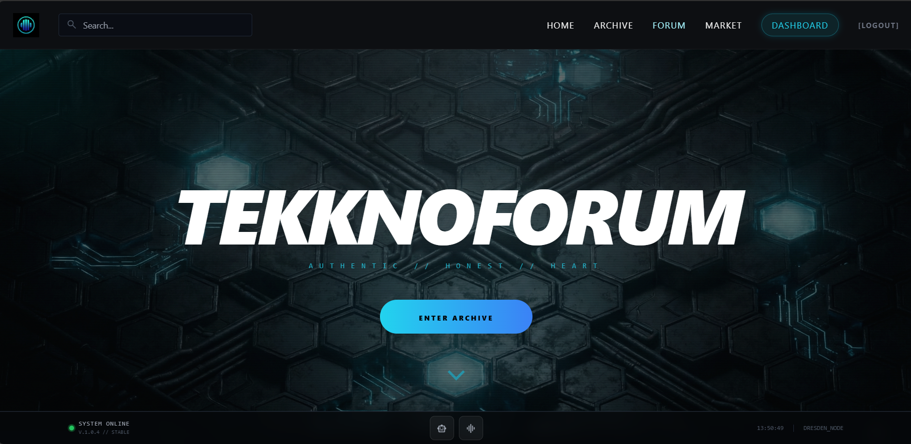

---

## 2. The Hive Mind (Community Module)
**Status:** Functional
Ein Echtzeit-Kommunikationshub, der klassische Foren-Strukturen mit modernem Chat-Design verbindet.
- **UI:** Dunkle "Card"-Optik für Threads.
- **UX:** Markdown-Support für Beiträge und klare Status-Indikatoren ("Secure Connection").

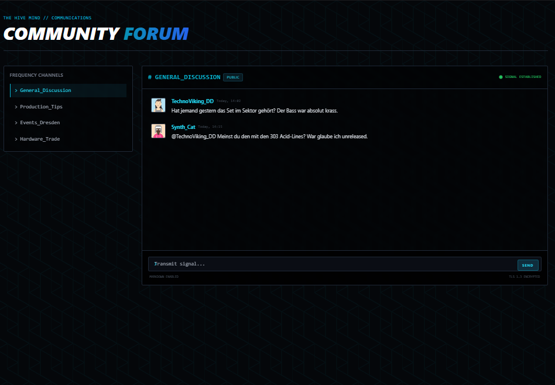

---

## 3. Black Market (E-Commerce)
**Status:** MVP Ready
Ein spezialisierter Marktplatz für Hardware (Synthesizer, Eurorack).
- **Architecture:** Datenbank-gestützte Produktverwaltung (SQLite/SQLAlchemy).
- **Filter Logic:** Kategorisierung nach Gear-Typen (Synth, Eurorack, DJ).

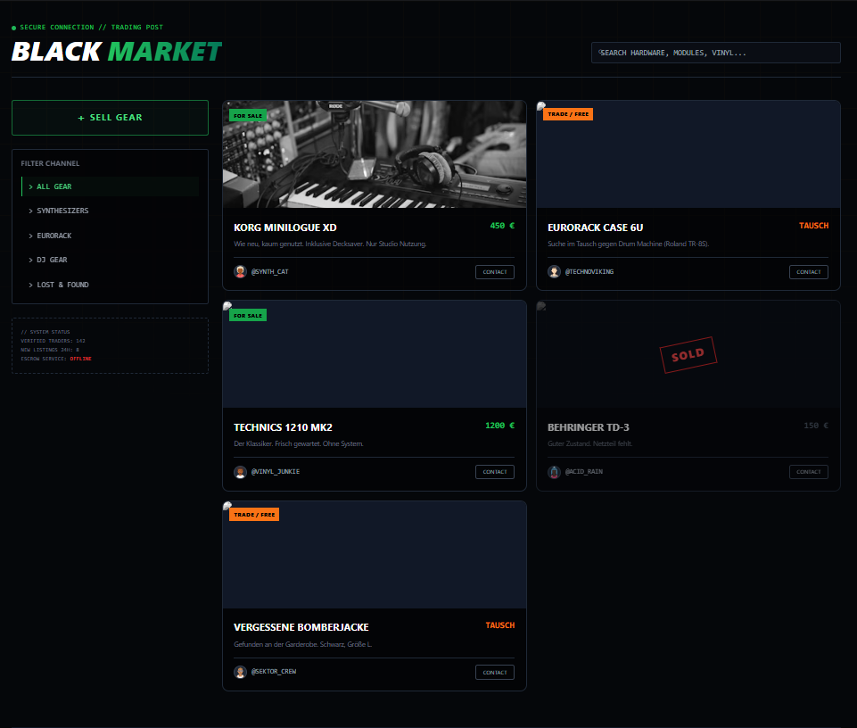

---

## 4. Artist Node & Dashboard
**Status:** Beta
Ein Dashboard für Künstler zur Verwaltung ihrer Statistiken und Tracks.
- **Data Viz:** Visualisierung von Streams und Revenue (Mockup-Daten im MVP).
- **Booking:** Integriertes Anfragen-Formular für Promoter.

### Artist Dashboard external - empty
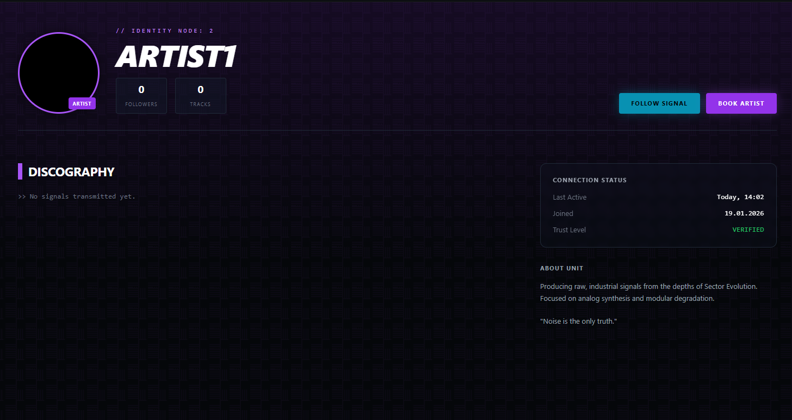

### Artist Dashboard external - filled
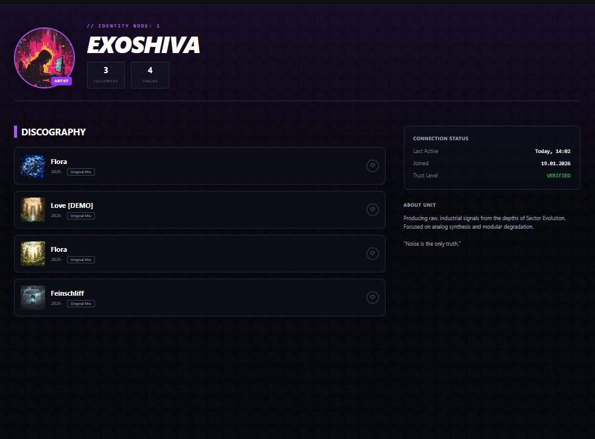

### Artist Dashboard internal
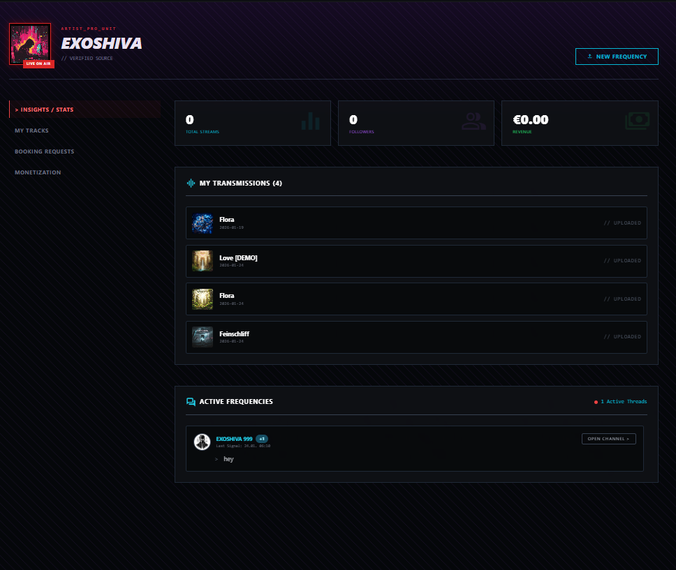

### Upload Dashboard
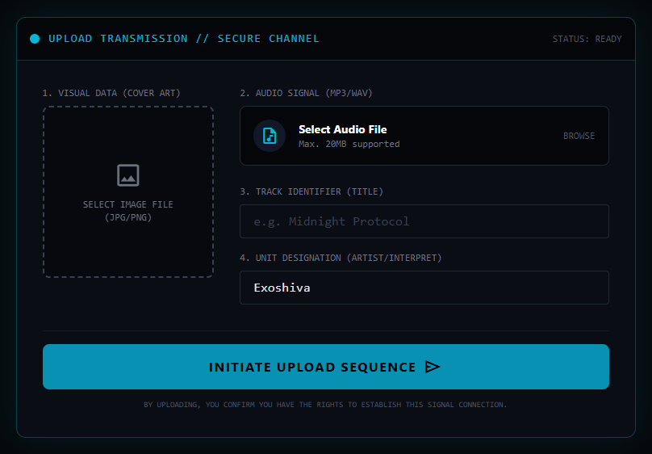

### Booking Dashboard
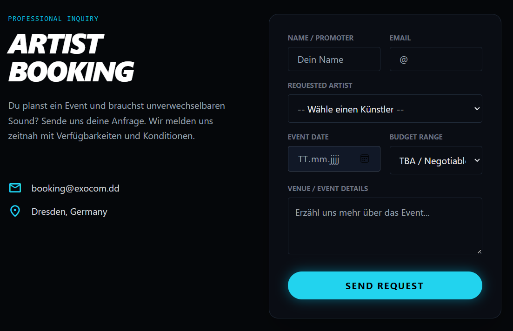

## 5. User Node & Dashboard
**Status:** Beta
Ein Dashboard für User zur Verwaltung ihrer Kontakte, Follows und gefolgten Playlists.

### User Dashboard external
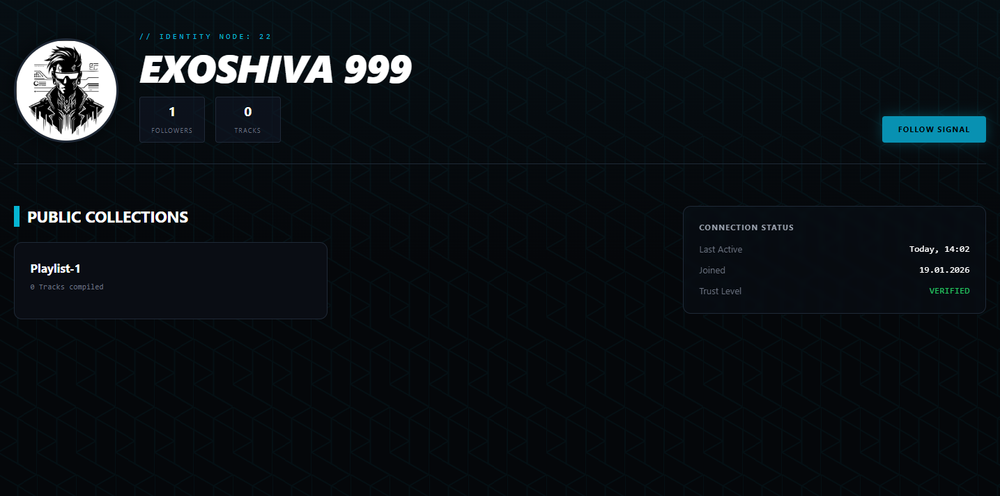

### User Dashboard internal
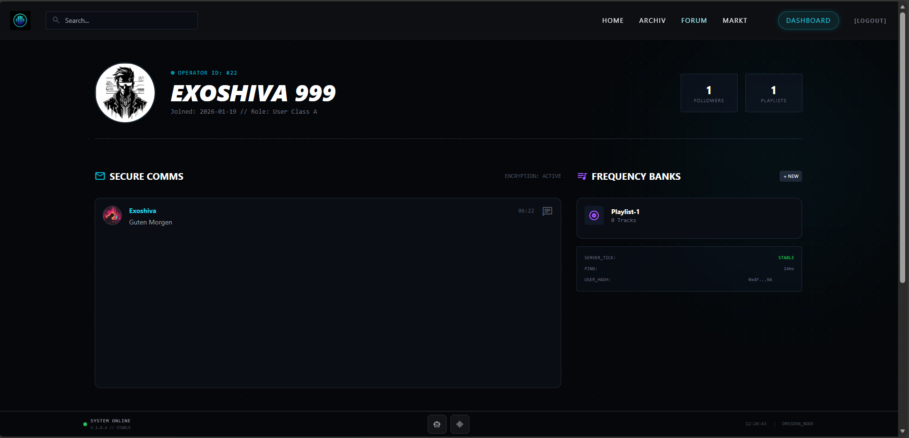

---

### 6. Event Dashboard
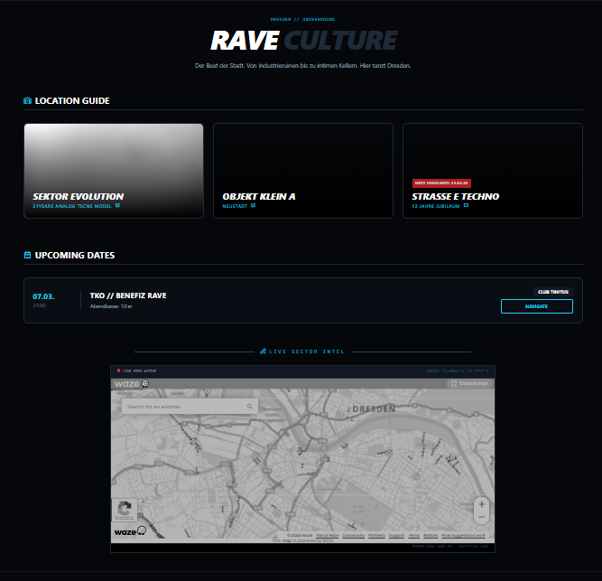

---

## 7. System Access & Security
**Status:** Implemented
Das Login-System ("System Access") führt die Cyberpunk-Lore fort.
- **Auth:** Flask-Login basierte Authentifizierung.
- **Design:** Terminal-inspirierte Eingabefelder.

  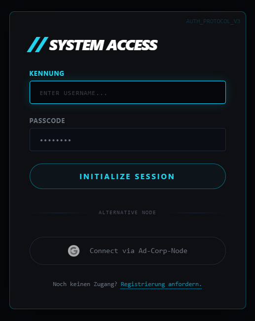
  &nbsp; &nbsp;
  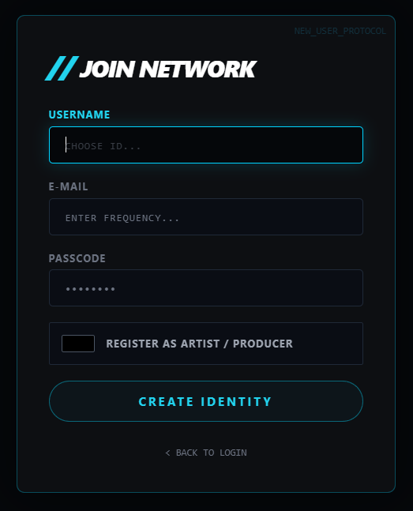

---

## 8. Error Handling & Lore
**Status:** Polished
Selbst Fehlerseiten sind Teil der User Experience.
- **404 Page:** "Lost Signal" Design statt Standard-Browser-Fehler.

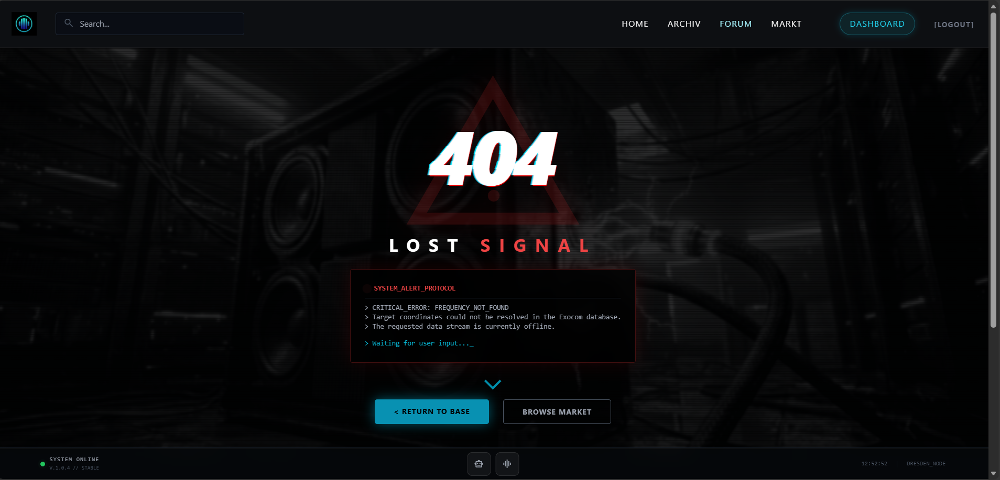
